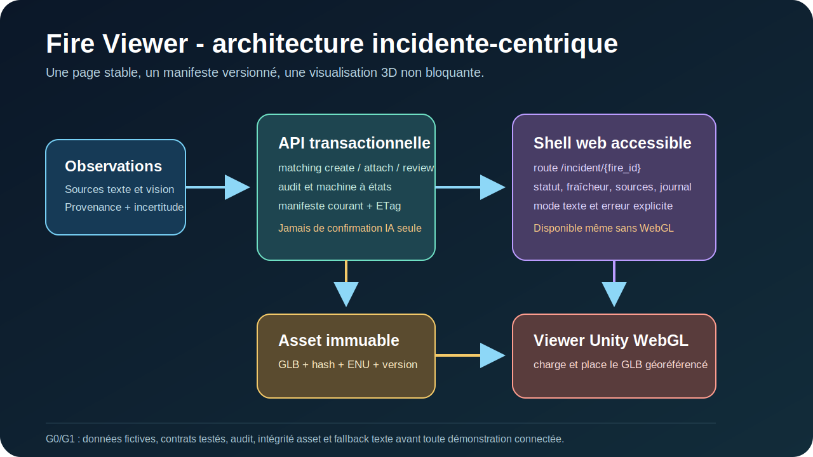

# Fire Viewer

> Prototype communautaire, incident-centrique et transparent pour visualiser des données d'incident avec leur provenance, leur fraîcheur et leur incertitude.



## Statut

**G0 - conception et fondations.** Le dépôt rassemble les sources reçues, la roadmap d'architecture et le backlog du premier vertical slice local. Il ne s'agit pas d'un service d'urgence, d'un outil de prévision, ni d'un système de confirmation automatique d'incendie.

En cas de feu ou de danger immédiat en France, contactez les secours au **18** ou au **112**. N'utilisez jamais ce prototype pour guider une intervention ou vous rapprocher d'un incendie.

## Principe du produit

Fire Viewer associe une page stable à une série d'incident identifiée par `fire_id`. Chaque épisode opérationnel reste traçable via `episode_id`, et chaque modèle 3D est référencé par un manifeste versionné et immuable.

- Le **backend** est la source de vérité pour les observations, le matching, l'audit et les manifestes.
- Le **shell web** affiche toujours les informations textuelles, l'état, la fraîcheur et les incertitudes.
- Le **viewer Unity/WebGL** est une couche de visualisation spatiale : il ne doit jamais être la seule source d'information.
- Les futurs agents IA ne produiront que des observations structurées. Ils ne pourront pas confirmer seuls un incident ni publier un état public.

## Organisation du dépôt

```text
apps/fire-viewer-ui/                 Interface React, TypeScript et Vite
services/fire-viewer-backend/        API FastAPI, SQLAlchemy et Alembic
contracts/                           Schémas JSON et fixtures de contrats publics et spatiaux
docs/                                Architecture, roadmap, analyse et plan G0/G1
assets/diagrams/                     Schémas maintenables du projet
archives/received/                   ZIP d'origine conservés localement et ignorés par Git
```

## Sources et documentation

- [Architecture cible](docs/ARCHITECTURE.md)
- [ADR-001 — Contrat public ViewerManifest v2](docs/adr/ADR-001-viewer-manifest-public-contract.md)
- [Schéma ViewerManifest v2](contracts/viewer-manifest/v2/viewer-manifest.schema.json)
- [ADR-002 — Contrat spatial local ENU et Unity](docs/adr/ADR-002-spatial-local-unity-contract.md)
- [Contrat spatial local v1](contracts/spatial/v1/README.md)
- [Analyse de la roadmap](docs/ANALYSE_ROADMAP.md)
- [Plan de suite G0/G1](docs/PLAN_DE_SUITE.md)
- [Roadmap source](docs/roadmap/roadmap_fire_viewer_incident_centrique_detaillee-1.pdf)
- [Contribution](CONTRIBUTING.md)
- [Sécurité](SECURITY.md)
- [Statut des licences](LICENSES.md)

## Baseline vérifiée — 12 juillet 2026

- **VÉRIFIÉ** : l'interface s'installe avec `npm ci`, passe `npm run check`, 10 tests Vitest de contrat et produit son build Vite avec `npm run build`. La route mockée `/incident/FR-83-00042` a été contrôlée en vues bureau et mobile, y compris la vue Sources.
- **VÉRIFIÉ** : le backend a été validé sous CPython 3.13.2 : migrations Alembic, Ruff, formatage Ruff, mypy, compilation Python et 40 tests automatisés sont passés. La couverture mesurée est de 87,29 % (seuil du projet : 80 %).
- **VÉRIFIÉ** : le verrou npm a été corrigé pour référencer le registre public npm, afin que `npm ci` ne dépende plus d'une URL interne indisponible hors de l'environnement de préparation.
- **NON VÉRIFIÉ** : l'intégration UI/API réelle avec `VITE_USE_MOCKS=false`, le démarrage HTTP du backend et Docker ne font pas partie de cette baseline. Le contrat est fixé par FV-003 ; le raccordement reste dans FV-006.

## Démarrage local

Les commandes ci-dessous correspondent aux scripts déclarés par les deux projets. La baseline ci-dessus a été exécutée sous PowerShell ; adaptez uniquement le choix de l'environnement Python à votre machine.

```powershell
# Interface
Set-Location apps/fire-viewer-ui
npm ci
npm run check
npm run build

# Backend
Set-Location ../../services/fire-viewer-backend
uv venv --python 3.13 .venv
uv pip install --python .venv\Scripts\python.exe -e '.[dev]'
.\.venv\Scripts\alembic.exe upgrade head
.\.venv\Scripts\python.exe -m pytest
```

## Contrat viewer public v2

Le contrat public est défini par l'[ADR-001](docs/adr/ADR-001-viewer-manifest-public-contract.md) :

- `GET /api/v1/incident/{fire_id}/manifest` est la ressource viewer canonique ;
- `ViewerManifest` v2 utilise `snake_case`, un `schema_version` obligatoire et les états `available`, `not_available` et `withheld` ;
- les réponses conditionnelles utilisent `ETag` et `If-None-Match` ; les erreurs viewer sont des Problem Details ;
- les sources, l'historique et le journal ne font pas partie de ce contrat public minimal.

**NON VÉRIFIÉ** : la page UI n'est pas encore connectée à cette API avec `VITE_USE_MOCKS=false`. Ce raccordement, le cache navigateur et les panneaux dégradés complets relèvent de FV-006.

## Contrat spatial local v1

**VÉRIFIÉ dans les artefacts FV-004** : l'[ADR-002](docs/adr/ADR-002-spatial-local-unity-contract.md)
et les [fixtures spatiaux](contracts/spatial/v1/fixtures/) fixent un profil rural local de
France continentale : origine `EPSG:4979` en `[longitude, latitude, hauteur]`, source
verticale `NGF-IGN69` convertie hors ligne par RAF20, ENU, GLB métrique et Unity à
`100` unités par mètre (`ViewerManifest.frame.meters_per_unit = 0.01`).

La Corse et les outre-mer sont hors périmètre de ce profil. Les zones sont réutilisables
uniquement à l'intérieur de leur emprise versionnée ; un snapshot de révision de manifeste
porte l'archive PNG et la provenance associée. Cesium ne fait pas partie de cette phase.

**NON VÉRIFIÉ** : aucun GLB rendu par Unity ni archive PNG réelle n'est encore livré. Les
contrôles de transformation, axes, origine et hash sont exécutés dans FV-004 ; le rendu et
l'archivage matériel resteront à intégrer avant toute affirmation d'alignement 3D.

## Sécurité et données

Ne placez dans ce dépôt ni position opérationnelle sensible, ni preuve brute, ni image de témoin, ni secret, ni fichier `.env`. Les archives reçues sont conservées localement pour provenance mais restent exclues de Git. Consultez [SECURITY.md](SECURITY.md) avant d'ouvrir une issue ou de contribuer.

## Licence

Le projet est libre, open source et gratuit :

- le code source du dépôt est sous [GNU AGPL-3.0-or-later](LICENSE) ;
- la documentation, la roadmap et les diagrammes sont sous [CC BY 4.0](LICENSE-DOCS.md).

Ces licences n'annulent pas les licences propres aux dépendances tierces ni les conditions de réutilisation des données géographiques. Elles n'offrent aucune garantie de disponibilité opérationnelle ou d'usage d'urgence. Les détails de périmètre sont dans [LICENSES.md](LICENSES.md).
